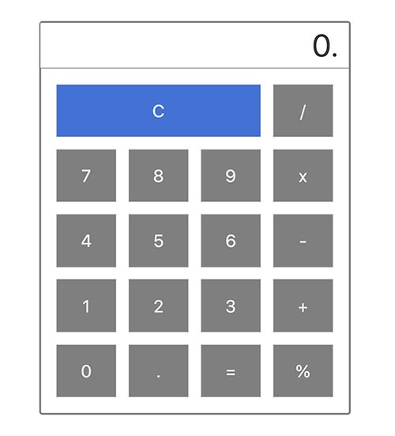

## Simple calculator built using statecharts

Implementation of calculator using statechart as described in Ian Horrock's book - 'Constructing the User Interface'



The demo can be found on codesandbox - https://codesandbox.io/s/github/mukeshsoni/statechart-calculator/tree/master/

To test it locally, clone the repository and run the following commands on your terminal

```
$ git clone https://github.com/mukeshsoni/statechart-calculator.git
$ cd statechart-calculator
$ npm install
$ npm run start
```
